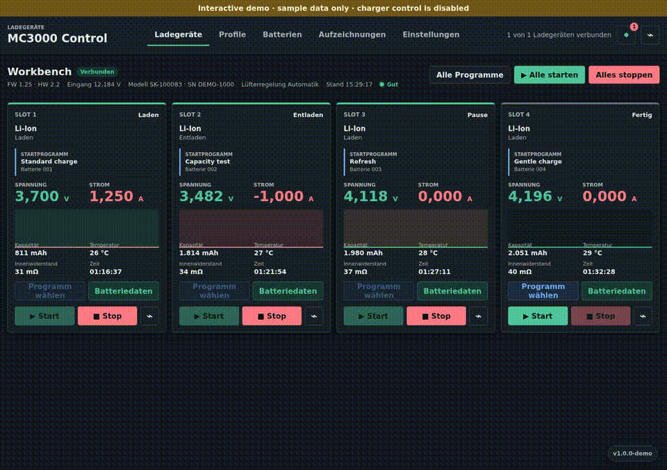

# Open MC3000 Control (OMC)

[Deutsche Dokumentation](README.md) · Demo after installation: `/?demo=1`

Open MC3000 Control (OMC) is a local, responsive web application for one or more SkyRC MC3000
chargers. A Linux computer maintains the Bluetooth Low Energy connections, records
measurements and provides charger control, profiles, battery records and reports to
browsers on the local network. Browsers do not need Bluetooth access.

This independent project is not affiliated with SkyRC.



More views: [dark dashboard](docs/images/dashboard-dark.png) ·
[profile library](docs/images/profiles.png) · [recordings](docs/images/recordings.png) ·
[WebM demo](docs/media/mc3000-control-demo.webm)

## Features

- Multiple MC3000 chargers with four live slots each
- Voltage, current, capacity, temperature, resistance and elapsed time
- Safe per-slot and all-slot start/stop controls with automatic BLE reconnection
- Charging profiles, categories, capacity-based programs and portable JSON exchange
- Battery records with weight, voltage range, current limits, dimensions, source links,
  reusable identifiers, QR labels, PDF sheets and permanent deletion
- Battery and program assignments remain visible after completion until the inactive
  slot detects removal from zero voltage or a debounced major voltage collapse
- Explicitly manual local cell-catalog imports from BetterBat/Zenodo, Second Life
  Storage and Lygte, followed by local model search and deliberate field transfer
- Program history, phase-aware charts, capacity/SOH reports, PDF and CSV exports
- Cell grouping by tested capacity and internal resistance
- SQLite storage, ZIP backup/restore and anonymized diagnostics
- No automatic catalog synchronization or background requests to external sources
- Optional login with scrypt password hashing and login rate limiting
- German/English UI, light/dark themes and responsive desktop/mobile layouts
- Installable progressive web app whose API and charger responses are never cached
- Read-only sample mode at `/?demo=1`; it never accesses Bluetooth or write APIs

Browsers require a secure context for PWA installation. Serve Open MC3000 Control through
HTTPS or open it as `localhost`; normal use on a trusted LAN continues to work over HTTP.

## Raspberry Pi installation

Use a current Raspberry Pi OS Lite 64-bit image. There are two supported installation
paths.

### Option A: install a stable release (recommended)

Download the current archive from the
[GitHub Releases page](https://github.com/x3muha/mc3000-control/releases/latest),
transfer and extract it, enter the extracted directory, then run:

```bash
./install.sh
```

This path requires no prior Git, Python, BlueZ or Python package setup.

### Option B: install the current Git revision

To use the newest revision from the `main` branch, install Git only for downloading the
repository and then run the same installer:

```bash
sudo apt update
sudo apt install -y git
git clone https://github.com/x3muha/mc3000-control.git
cd mc3000-control
./install.sh
```

The release is the recommended, fixed and versioned build. A Git clone may already
contain changes that have not yet been published as a release.

With either path, the installer requests administrator privileges, installs all other
dependencies, enables Bluetooth, creates a dedicated service account and isolated
Python environment, starts the service and checks its health. Open
`http://<RASPBERRY-PI-IP>:8083/` afterward.

See [INSTALL_RASPBERRY_PI.en.md](INSTALL_RASPBERRY_PI.en.md) for the complete process or
[INSTALL_LINUX.en.md](INSTALL_LINUX.en.md) for other Linux hosts.

## Manual cell catalog

`Cell catalog` in the battery manager lists the three fixed sources. Only pressing
`Import selected sources` downloads their current public data into the local SQLite
database. Imports never run automatically or in the background, and a failed source
refresh keeps its last successful local snapshot.

When creating or editing a battery, search the local catalog for terms such as
`Samsung INR` and deliberately apply one result. This copies record and documentation
fields only. It does not set protection, a default program, a charging profile or a
program start. The source URL and all imported source fields remain attached to the
battery record.

## Compatibility

MC3000 hardware 2.2 with firmware 1.25 is verified with real chargers. Python 3.11,
3.12 and 3.13 are tested automatically. Raspberry Pi OS Bookworm and Trixie are
supported by the installer; BlueZ 5.55 or newer is required. See the full
[compatibility matrix](docs/COMPATIBILITY.md).

The charger is accessed only over BLE. Direct USB and Bluetooth SPP connections are not
supported. One BLE client can use a charger at a time, so disconnect the official app
while Open MC3000 Control is connected.

## Development

```bash
python3 -m venv .venv
. .venv/bin/activate
python -m pip install -e '.[test]'
python -m pytest -q
```

Additional checks and test boundaries are documented in [tests/README.md](tests/README.md).
Contributions are described in [CONTRIBUTING.md](CONTRIBUTING.md), releases in
[CHANGELOG.md](CHANGELOG.md), and private vulnerability reporting in
[SECURITY.md](SECURITY.md).
The release gate is documented in [docs/SECURITY_REVIEW.md](docs/SECURITY_REVIEW.md).
Runtime dependency licenses are documented in
[THIRD_PARTY_NOTICES.md](THIRD_PARTY_NOTICES.md) and checked in CI against an
allowlist of permissive licenses.

## Safety

Always verify chemistry, capacity, currents, voltage limits, temperature limit and the
physical cell assignment before starting a program. Reports do not replace a qualified
safety inspection of cells or battery packs. Do not expose the HTTP service directly to
the internet; use HTTPS or a trusted VPN when crossing an untrusted network.
Catalog data may be incomplete, outdated or contradictory. Verify the cell marking,
manufacturer datasheet, chemistry, voltage limits and permitted currents before use;
imported limits are never transferred to a charger automatically.

## License

[MIT](LICENSE). Separately installed runtime dependencies retain the licenses listed in
[THIRD_PARTY_NOTICES.md](THIRD_PARTY_NOTICES.md).
